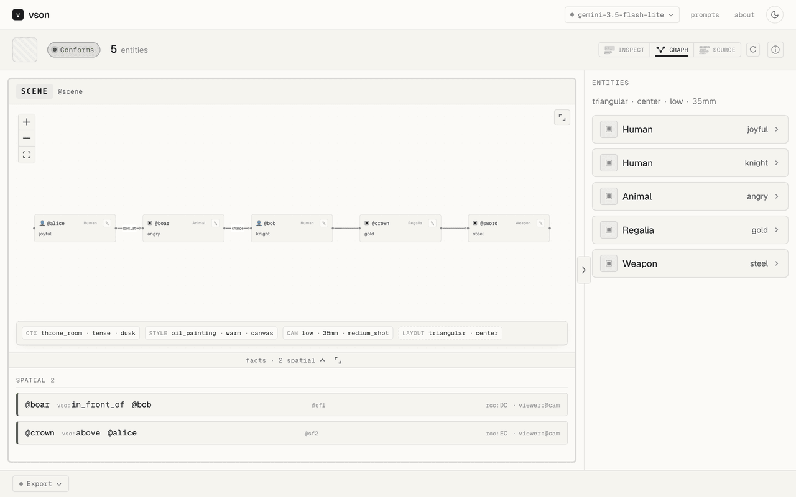

# VSON — Visual Scene Ontology Notation

[](https://github.com/yamancan/visual-scene-ontology/actions/workflows/ci.yml)
[](spec/CHANGELOG.md)
[](tests/conformance/manifest.ttl)
[](https://w3id.org/vson/v1/ontology)
[](LICENSE)

An image is not a sentence. **A vision-language model's description of an image is unvalidated prose: there is no schema it can violate, so nothing can reject one and no build can fail on it.** VSON makes every claim about an image — an object, a property, a spatial relation, an action — a graph assertion a validator can reject, gated by SHACL shapes. It checks the graph, not the picture: [§2.1](docs/vson.md#21-what-conformance-establishes) states exactly what a green result does and does not establish. Built for image-generation pipelines, scene-graph researchers, and people evaluating VLM output.

## Try it — [vson-studio.pages.dev](https://vson-studio.pages.dev)

Drop a photo, get a scene graph. No account, no key, nothing to install: the demo images and the 16-scene gallery replay baked envelopes at $0, and verification runs in your browser — a Pyodide worker executes two of the CLI's three gates (pyshacl SHACL, then owlrl OWL 2 RL); the third, C2 vocabulary closure, is CLI-only. Live extraction of your own images runs on your own OpenRouter key, browser → OpenRouter, never touching a studio host.



*Pictured: [`examples/gallery/11_throne_room.vson`](examples/gallery/11_throne_room.vson) opened from the gallery — a hand-authored document, no model call and no image in the loop.*

## See it fail, then pass

```console
$ vson validate tests/fixtures/bad_no_viewer.vson
Validation Report
Conforms: False
Results (1):
Constraint Violation in MinCountConstraintComponent (http://www.w3.org/ns/shacl#MinCountConstraintComponent):
	Severity: sh:Violation
	Source Shape: [ sh:class vso:CameraView ; sh:maxCount Literal("1", datatype=xsd:integer) ; sh:message Literal("Directional spatial facts require exactly one vso:viewer for construal disambiguation (C5), and that viewer must be a CameraView, never an Entity.") ; sh:minCount Literal("1", datatype=xsd:integer) ; sh:not [ sh:class vso:Entity ] ; sh:path vso:viewer ]
	Focus Node: :sf
	Result Path: vso:viewer
	Message: Directional spatial facts require exactly one vso:viewer for construal disambiguation (C5), and that viewer must be a CameraView, never an Entity.
FAIL tests/fixtures/bad_no_viewer.vson (shacl)
one or more files failed validation
$ echo $?
1
```

```console
$ vson validate examples/gallery/04_directional_with_viewer.vson
OK  examples/gallery/04_directional_with_viewer.vson
$ echo $?
0
```

That failing document is [`tests/fixtures/bad_no_viewer.vson`](tests/fixtures/bad_no_viewer.vson), and [CI runs both halves on every commit](.github/workflows/ci.yml) — a gate nobody has seen go red is a gate nobody should trust.

**Receipts.** [218-entry conformance suite](tests/conformance/) · [604 Python tests](Makefile) · [29 competency questions, 28 of them run by CI against byte-frozen answers](queries/) · [byte-parity Rust and Python implementations](cli/) · [w3id IRIs that dereference](https://w3id.org/vson/v1/ontology). Every number on this page is checked by a `make` target in this repository.

## Install

**Rung 0 — nothing.** [The studio](https://vson-studio.pages.dev) needs no install, no account and no key.

**Rung 1 — a binary.** There are no release binaries yet, so the two rungs below build from source.

**Rung 2 — Python.**

```bash
pip install .        # or -e . to develop against the checkout; both work from any cwd
python3 -c "import vson; print(vson.validate('examples/throne_room.vson').conforms)"   # True
```

**Rung 3 — the CLI and the gates.**

```bash
cd cli && cargo build --release   # the vson binary, the MCP server and the exporters (~30s cold)
make deps                         # rdflib, pyshacl, owlrl — the gates `vson validate` runs
```

Then verify the checkout:

```bash
make check         # runs all 17 gates — 604 Python tests, the 16-scene gallery,
                   # and the 29 frozen canonical hashes of §4.6
# or run one gate on its own:
make conformance   # the 218-entry conformance suite — what claiming VSON v1 means
make cq-check      # the 28 executable competency questions vs their frozen answers
make cli-check     # Rust tests + byte-strict & graph-iso parity vs the Python reference
make x-check       # VSON-X gallery round-trip parity (12 pairs)
```

## What a VSON document looks like

VSON-P, the Penman authoring syntax — [`examples/gallery/04_directional_with_viewer.vson`](examples/gallery/04_directional_with_viewer.vson):

```
(scene / Composition
   :framedBy (cam / CameraView :angle eye_level :focalLength 35mm :framing wide_shot)
   :viewedBy cam
   :depicts (lamp / PhysicalObject
               :individuation Generic :animacy Inert :countability Count
               :class Lamp)
   :depicts (chair / PhysicalObject
               :individuation Generic :animacy Inert :countability Count
               :class Furniture)
   :hasFact (sf / SpatialFact
               :figure lamp
               :ground chair
               :viewer cam
               :directional left_of
               :rcc DC))
```

*Left of* from whose vantage? A directional fact must name exactly one `:viewer` and that viewer must resolve to a `CameraView` — a constraint on a value's *type at the other end of an edge* that no JSON Schema expresses, and that [`vss:DirectionalNeedsViewerShape`](shapes/vson-shapes.ttl) rejects the document for breaking (C5).

`vson export caption` renders a document with templates, not a model — byte-identical on every run, CI-frozen against [`tests/fixtures/captions/11_throne_room.txt`](tests/fixtures/captions/11_throne_room.txt):

```console
$ vson export caption examples/gallery/11_throne_room.vson
Oil painting on canvas, warm palette, low medium shot, 35mm lens, in a throne room, tense atmosphere, at dusk. Alice, a joyful queen human age 30, an angry charging animal, Bob, a focused knight human, a gold regalia with glowing enchantment, and a steel weapon. The animal charges Bob. Alice looks at the animal. Bob holds the weapon. Bob strikes the animal with the weapon. The animal is in front of Bob. The regalia is above Alice.
```

## Why not just a JSON schema?

Most of the time you should.

If your extractor emits one object per image, a pydantic model handed to a structured-output endpoint is the right tool and VSON is ceremony — and a grammar compiled from that schema makes the wrong token unemittable, which beats validating after the fact outright. **[`docs/why-not-json-schema.md`](docs/why-not-json-schema.md)** is the honest version of the comparison: the scene model a competent engineer ships today, as real pydantic, beside the four constraints it structurally cannot express — a directional relation whose viewer must resolve to a camera, a Composition that must depict at least one *Entity*, closed value sets dispatched on the class of the bearer, and figure/ground asymmetry on a reified fact. Each one is paired with the SHACL shape that expresses it and the checked-in fixture that JSON Schema accepts and a `vson` gate rejects, with the command to run it. It also names the alternatives — Instructor, Outlines, XGrammar, BAML, vendor JSON modes — and where each one wins, and lists when VSON is the wrong choice.

## Fail a build on it

```yaml
# .github/workflows/scenes.yml
- uses: yamancan/visual-scene-ontology/.github/actions/validate@v1.4.0
  with:
    files: 'scenes/**/*.vson'
```

Every violation becomes an annotation on the line that caused it — the SHACL shape that fired, on the Penman variable that declared the node — plus a table in the job summary. Nothing to install, no Marketplace listing, no token. [`.github/actions/validate/action.yml`](.github/actions/validate/action.yml) documents every input. That `uses:` line works from any repository; inside this one, CI uses `uses: ./.github/actions/validate`.

**The cost, stated up front:** the action builds the CLI with `cargo` — about twenty seconds of compile time on a warm registry, removed on later runs by `Swatinem/rust-cache@v2` with `workspaces: cli`. It will keep building from source until release binaries exist and the action learns to fetch them.

Locally, the same three gates run as a [pre-commit](https://pre-commit.com) hook:

```yaml
# .pre-commit-config.yaml
repos:
  - repo: https://github.com/yamancan/visual-scene-ontology
    rev: v1.4.0
    hooks:
      - id: vson-validate
```

And in any other pipeline, straight from the binary — exit 0 conformant, 1 a document that failed a gate, 2 no verdict:

```bash
vson validate --format sarif scenes/*.vson > vson.sarif   # SARIF 2.1.0, for any code scanner
cat scene.vson | vson validate --format json -            # stdin, one record per violation
```

[§5.16](docs/vson.md#516-machine-readable-validation-reports-vson-validate---format) is the report format: one record per violation carrying the shape, the focus node, the result path, the severity and — where it can be established rather than guessed — the source line. It checks the graph, not the picture ([§2.1](docs/vson.md#21-what-conformance-establishes)); a green build is not a claim about the image.

## Query it, diff it

[`queries/`](queries/) holds 29 competency questions as SPARQL, 28 of them run by CI on every commit over the 17-document corpus, each answer compared byte-for-byte with a frozen one. [§5.14.1](docs/vson.md#5141-what-the-questions-cover) maps each structural claim on this page to the questions that reach it, so "it is queryable" is a thing you run rather than a thing this page asserts.

`vson diff a b` aligns away the arbitrary names each run gave its nodes and reports triple-level precision, recall and F1, overall and per layer, so a regression lands on *spatial* or *objects* instead of on one number ([§5.15](docs/vson.md#515-graph-agreement-vson-diff)). It exits 1 when the documents differ — by design, so CI can gate on drift:

```console
$ vson diff examples/throne_room.ttl examples/gallery/11_throne_room.vson
vson diff — Smatch graph agreement (docs/vson.md §5.15)
  a  examples/throne_room.ttl  (148 triples)
  b  examples/gallery/11_throne_room.vson  (131 triples)
  alignment: seed 0, 5 restarts

  layer              match      a      b  precision   recall       F1
  objects               10     15     10     0.6667   1.0000   0.8000
  attributes            48     63     68     0.7619   0.7059   0.7328
  spatial               12     14     14     0.8571   0.8571   0.8571
    viewer-blind        10     12     12     0.8333   0.8333   0.8333
  frames                18     18     18     1.0000   1.0000   1.0000
  events                19     24     21     0.7917   0.9048   0.8444
  other                  0     14      0     0.0000        —   0.0000
  overall              107    148    131     0.7230   0.8168   0.7670
smatch: the two documents differ (F1 0.7670). Agreement between two documents, not evidence about the image.
examples/throne_room.ttl and examples/gallery/11_throne_room.vson are not the same graph. This is agreement between two documents; no image was read and neither document is thereby correct (docs/vson.md §2.1).
```

## For scene-graph researchers

[`docs/importers.md`](docs/importers.md) — GQA / Visual Genome / PSG mapping tables and the two policies · [`docs/eval/coverage.md`](docs/eval/coverage.md) — measured vocabulary coverage · [`docs/eval/attribution.md`](docs/eval/attribution.md) — the licence review that holds anything dataset-derived · [`tests/conformance/manifest.ttl`](tests/conformance/manifest.ttl) — the suite that defines conformance.

Reifying a spatial relation with required, asymmetric figure and ground slots is standardized practice: ISO 24617-7:2020 names those two arguments `@figure` and `@ground`, SemEval-2012's spatial-role-labelling task ran on the same pair as *trajector* and *landmark*, and anchoring a directional to a frame of reference is Levinson's analysis. VSON has neither their annotated corpora nor their agreement studies; [Appendix E.7](docs/vson.md#appendix-e--related-work-and-bibliography) states what each of them does that this does not.

There is no accuracy figure. The extraction eval is pre-registered: [`tools/extractor/baseline/results.md`](tools/extractor/baseline/results.md) commits the decision rule, the Wilson interval and an ablation-invalidation gate before any API call, so the conclusion cannot be retrofit.

## What ships

- a reified **Frame** taxonomy — `SceneContext` / `VisualStyle` / `CameraView` / `Composition` / `Persona`
- a **trait-bundle entity model**: `individuation × animacy × countability × affordance`
- a **`SpatialFact`** reification pattern — RCC-8 + Allen + frame-relative directionals with a mandatory viewer
- a closed **VSV** vocabulary: RCC-8 and Allen base relations, coarse VerbNet-style thematic roles, mereology, causation
- **three concrete syntaxes**: Turtle-star (VSON-T, canonical), Penman (VSON-P, authoring) and VSON-X (compact, sigil-based, LLM-oriented)
- a deterministic **caption renderer** for image-generation models — graph → English, no model in the loop
- **SHACL** gatekeeping with strict and relaxed profiles
- shipped **exporters**: Cypher / caption / FOL (CLI) and Cypher / DOT / GraphML / Mermaid / caption / FOL (studio, in-browser), plus a published JSON-LD form

## What it rides on

VSON invents no parser, grammar or formal semantics:

- **RDF 1.2 / RDF-star** — abstract semantics
- **OWL 2 RL** — decidable reasoning fragment
- **SHACL** — well-formedness
- **SPARQL 1.1** — query ([§5.14.2](docs/vson.md#5142-sparql-11-and-what-the-pack-defers) records what the pack defers)
- **RDFC-1.0** — canonical form, so "these two documents describe the same scene" is a byte comparison and not an opinion ([§4.6](docs/vson.md#46-denotation--when-two-documents-describe-the-same-scene))
- **Penman** — authoring concrete syntax, proven by AMR

## Use it from an agent (MCP)

`vson mcp` serves the emit → validate → feed-the-messages-back loop as an [MCP](https://modelcontextprotocol.io) stdio server: JSON-RPC over stdin and stdout, no port, no host, no key.

```bash
claude mcp add vson -- python3 -m vson.mcp          # from a checkout
claude mcp add vson -- /path/to/vson mcp            # or the built binary, anywhere
```

| Tool | Give it | You get back |
|---|---|---|
| `vson_validate` | `document` (the text) or `path`; optional `syntax` (`t` \| `p` \| `x`), `profile` | the three gates' verdict as JSON — `conforms`, the `gate` that fired, and one finding per violation with its `sh:message`, shape, focus node and result path. A document that fails is a **result**, not an error: that JSON is the repair prompt |
| `vson_convert` | `direction: p2t\|x2t` and the document | the Turtle. No reverse direction exists ([§6.1](docs/vson.md#61-the-extractor-envelope-schema)) |
| `vson_export` | `format: caption\|fol\|cypher` and the document | the rendering, as text |
| `vson_skill_prompt` | optional `notation: p\|x` | [`skills/vson-extractor/SKILL.md`](skills/vson-extractor/SKILL.md), verbatim — the closed vocabulary and the clauses, **before** the agent writes rather than after it is rejected |

- **`document` is text, `path` is a file** — whichever you gave is what gets read, all the way down. `{"document": "scene.vson"}` is ten characters of a document, never the file of that name next to the server ([§5.18.1](docs/vson.md#5181-the-four-tools)).
- **No image, no network.** Every tool is [`vson/api.py`](vson/api.py) behind a JSON envelope.

[`.mcp.json`](.mcp.json) is tracked, so opening a clone in an MCP-aware client will offer to run the local stdlib-only server — that is expected. [`vson/mcp.py`](vson/mcp.py) adds no dependency to this project; [§5.18](docs/vson.md#518-agent-tool-surface-vson-mcp) documents the revisions it speaks and what it deliberately does not serve.

## Use it from Python

```python
import vson

verdict = vson.validate("examples/throne_room.vson")  # a path or the text; .ttl / .vson / .x.vson
verdict.conforms, verdict.gate, verdict.messages      # True, None, []

vson.to_turtle(penman)          # p2t              vson.diff(a, b).f1         # agreement, §5.15
vson.from_x(vson_x)             # x2t              vson.canonical_hash(doc)   # §4.6
vson.caption(doc)               # graph → English, deterministic, no model in the loop
vson.fol(doc)                   # graph → predicate logic
```

`validate_and_repair` is the studio's emit → validate → feed-the-SHACL-messages-back loop as a library call. It takes **your** chat function and nothing else: no vendor SDK is imported, no API key is read, and whatever you pass as `image_or_doc` is forwarded to round 0 untouched.

```python
def chat(turn):                        # turn.round, turn.system, turn.user, turn.attachment
    ...                                # your model call, your key, your SDK
    return reply_text

result = vson.validate_and_repair(chat, image_or_doc=jpeg_bytes)
print(result.conforms, result.shacl_retries)          # e.g. True 1

envelope = result.to_envelope("kitchen_01", source=vson.Source(kind="image"))
assert envelope.errors() == []                        # valid against ENVELOPE_SCHEMA
```

The loop is bounded at two repair rounds — the studio's own `MAX_REPAIR_RETRIES`, pinned against [`web/src/lib/extract/limits.ts`](web/src/lib/extract/limits.ts) by a test that reads it back. `SKILL_PROMPT`, the two repair templates and `ENVELOPE_SCHEMA` are read from [`skills/`](skills/) and [`tools/schema/`](tools/schema/) at import, not restated.

## Namespace and permanent IRIs

The canonical namespace is [`https://w3id.org/vson/v1/ontology`](https://w3id.org/vson/v1/ontology), and it dereferences — the [w3id redirect](https://github.com/perma-id/w3id.org/pull/6471) merged on 2026-07-31:

```bash
curl -L https://w3id.org/vson/v1/ontology
```

Every canonical name resolves to its Turtle document, served from [vson.pages.dev/v1/](https://vson.pages.dev/v1/ontology.ttl). Content negotiation is not implemented: an `Accept: application/ld+json` request gets the same Turtle. `make live-check` re-verifies all eight names against the live services.

Release v1.4.0 · notation spec v1.3 · the TBox is unchanged since 1.2, so `owl:versionInfo` stays 1.2 and `owl:versionIRI` points at `/v1.2/` — three numbers, one discipline.

## What's new here — and what isn't

VSON's genuinely-new content (everything else is W3C/ISO):

1. **Frame taxonomy** as a first-class perspectival layer distinct from `Entity`.
2. **Trait-bundle entity model** — orthogonal axes replace the folk Object/Item/Unique/Attribute mess.
3. **`SpatialFact` with a viewer a validator enforces** — not a new idea, and this list said otherwise until v1.3. Reifying a spatial relation with required, asymmetric figure and ground slots is standardized practice: ISO 24617-7:2020 requires a link structure to carry a relation type and two arguments, and names those two `@figure` and `@ground` in its revised movement link; SemEval-2012's spatial-role-labeling task ran on the same pair under the names *trajector* and *landmark*. Anchoring a directional to a frame of reference is Levinson's analysis. What VSON commits to is narrower: **one** frame (the relative one) rather than an annotation of which frame is in use, and the anchor as a **structural obligation with an exit code** — C5 and `vss:DirectionalNeedsViewerShape` reject the document, where the prior schemes instruct the annotator. [Appendix E.7](docs/vson.md#appendix-e--related-work-and-bibliography) states what each of them does that this does not, including the annotated corpora and published agreement studies VSON has neither of.
4. **Closed VSV vocabulary** curated for visual scenes.
5. **Penman authoring surface** tuned for VSV.
6. **VSON-X compact syntax** — nine prefix sigils, no brackets, LL(1), bearer-class dispatch for `*K V`. All 12 gallery scenes that have a VSON-X counterpart denote the same scene as their Penman twin under [§4.6](docs/vson.md#46-denotation--when-two-documents-describe-the-same-scene): identical RDFC-1.0 canonical N-Quads, frozen in [`tests/fixtures/canonical/hashes.txt`](tests/fixtures/canonical/hashes.txt).
7. **Persona / cross-document identity** — `vso:Persona` Frame + `vso:embodies` lets the same character appear in many scenes with consistent invariants.
8. **Deterministic caption renderer** — graph → English, template-driven, byte-identical CI fixtures.
9. **Exporter matrix** — shipped Cypher / caption / FOL (CLI) and Cypher / DOT / GraphML / Mermaid / caption / FOL (studio, in-browser) exporters, plus a published JSON-LD form; spec-only mappings for AMR / Visual Genome / USD.

## Status and what isn't done

Solo maintainer, release v1.4.0, zero users and no adopters list. The envelope wire format is stable. There are no release binaries yet, no PyPI package, no crates.io crate and no DOI. The extraction-accuracy eval is pre-registered and has not been run: the pre-registered threshold is 0.80 and it has not been measured ([`tools/extractor/baseline/results.md`](tools/extractor/baseline/results.md)).

Do not trust the prose; run `make check`.

## Docs

- [`docs/vson.md`](docs/vson.md) — the canonical single-file spec: quick start, per-field reference, JSON Schema, gallery
- [`docs/why-not-json-schema.md`](docs/why-not-json-schema.md) — the comparison, with fixtures and commands
- [`docs/vson-x-semantics.md`](docs/vson-x-semantics.md) — VSON-X surface semantics
- [`docs/importers.md`](docs/importers.md) — GQA / Visual Genome / PSG → VSON-P
- [`docs/eval/`](docs/eval/) — measured vocabulary coverage and the licence review
- [`tests/conformance/`](tests/conformance/) — the suite that defines conformance (§2.2)
- [`queries/`](queries/) — the competency questions and their frozen answers
- [`cli/README.md`](cli/README.md) — the Rust CLI
- [`web/README.md`](web/README.md) — the studio, and how to run it locally
- [`docs/repo-map.md`](docs/repo-map.md) — every directory in this repository, annotated

## Contributing · Security · Citing · License

- [CONTRIBUTING.md](CONTRIBUTING.md) — the gates to run before a pull request
- [SECURITY.md](SECURITY.md) — threat model and how to report a vulnerability
- [CITATION.cff](CITATION.cff) — no DOI yet; cite the repository
- [LICENSE](LICENSE) — Apache-2.0
